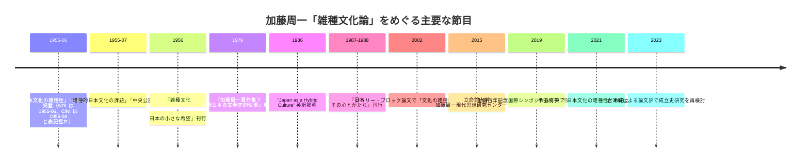

## エグゼクティブサマリー

加藤周一の「雑種性」論は、1955 年の論文「日本文化の雑種性」を起点に、同年の「雑種的日本文化の課題」から、1956 年の単行本『雑種文化』へと展開した、戦後日本文化論の重要な出発点である。国立国会図書館の号誌情報によれば、「日本文化の雑種性」は『思想』第 372 号の特集「日本文化について」に掲載され、本文は pp.5-17 に置かれていた。英訳 "Japan as a Hybrid Culture" は 1986 年に *Review of Japanese Culture and Society* 1 巻 1 号に pp.15-24 で掲載され、英語圏の日本研究にも流通した。もっとも、CiNii のメタデータには 1955 年 4 月とあるため、書誌上は月次表記に揺れがある。本稿では、特集号の現物目次を示す NDL 記録に従い、1955 年 6 月号を採る。

加藤のいう「雑種性」は、単に「混ざっている」という記述ではない。中国・仏教・西欧など外来文化の導入、模倣、変形、再編を、日本文化の周縁的な現象ではなく、その構造そのものとして捉える視角である。そしてこの視角は、戦争を止められなかった日本の知識人と社会の閉鎖性を反省し、「純粋な日本文化」や「単一の国民文化」という神話を相対化する、倫理的・政治的含意をもっていた。後年の『日本文学史序説』では、この関心は「土着世界観」と外来イデオロギーの相互作用を追う方法へと深化した。

研究史では、ジュリー・ブロック、矢野昌邦、小関素明、劉争、半田侑子らが、雑種文化論の成立・変容・方法論的意義を検討してきた。近年は立命館大学の加藤周一文庫と研究センターの活動を背景に、草稿・ノート・講読会資料を踏まえた再検討が進んでいる。受容の面では、高校国語教科書における採録頻度が高く、英訳・中国語訳・東アジア国際シンポジウムを通じて、日本文化論を越える普遍的論点として再読されている。反面、帝国・植民地・権力の非対称性への目配りが薄いこと、「日本文化」という総体をなお前提してしまうこと、そして「雑種」という比喩自体の今日的な語感の問題は、なお残された課題である。

## 一次資料

加藤の「雑種性」論を考えるさい、最重要なのは、まず 1955 年の二論文である。ひとつは『思想』特集「日本文化について」に載った「日本文化の雑種性」で、もうひとつは同年『中央公論』に載った「雑種的日本文化の課題」である。後者はのちに「雑種的日本文化の希望」と改題され、単行本『雑種文化 : 日本の小さな希望』に収められた。この改題は小さく見えて重要で、加藤の議論が単なる「問題の指摘」から、「日本の近代を再建するための可能性の提示」へ移る方向を示している。さらに重要なのは、『言葉と戦車を見すえて』が「全篇発表時の初出より収録」と明記して、初出形に近いかたちで両論考を再読可能にしている点である。

一次資料の整理には、原誌掲載、初の単行本化、著作集での再収録、そして英訳・後続の展開を押さえる必要がある。とくに『加藤周一著作集』第 7 巻は、加藤存命中に編まれた平凡社版著作集の一冊で、後続研究の多くが「日本文化の雑種性」「雑種的日本文化の希望」の引用元として参照しており、研究上の標準的な参照先となっている（参照頁の特定は劉争 2020 や半田 2021 等の本文を要確認）。ウェブ上で全収録頁範囲を完全には確認できなかった箇所もあるので、下表では「確認できた頁等」として区別して示す。英訳 "Japan as a Hybrid Culture" は、概念の国際的流通にとって決定的な資料である。

下表の書誌整理は、主として NDL、CiNii、出版社目録、JSTOR の誌情報、および関連研究の書誌注記に基づく。

| 区分 | 書誌 | 確認できた頁等 | 一文注記 |
|---|---|---:|---|
| 中核原論文 | 加藤周一「日本文化の雑種性」『思想』(372), 岩波書店, 1955 | pp.5-17 | 「日本文化について」特集の中核論文で、雑種性論の出発点。 |
| 中核原論文 | 加藤周一「雑種的日本文化の課題」『中央公論』70 巻 7 号, 1955 | 頁数未確認 | のちに「雑種的日本文化の希望」と改題される姉妹篇。 |
| 初単行本 | 加藤周一『雑種文化 : 日本の小さな希望』大日本雄弁会講談社（ミリオン・ブックス）, 1956, 204p | 204p | 二論考を含む複数篇を収め、雑種文化論を広く定着させた初のまとまった本。 |
| 標準的再録 | 加藤周一『加藤周一著作集 7 近代日本の文明史的位置』平凡社, 1979 | 後続研究で参照される版（個別頁の確定は劉争 2020 / 半田 2021 等の本文を参照） | 後続研究が多く参照する著作集版。 |
| 初出形再読用 | 加藤周一『言葉と戦車を見すえて : 加藤周一が考えつづけてきたこと』筑摩書房, 2009 | 頁数未確認 | 目録で「日本文化の雑種性」「雑種的日本文化の課題」を収め、初出形での再読を志向。 |
| 英訳 | Shuichi Kato, "Japan as a Hybrid Culture," *Review of Japanese Culture and Society* 1(1), 1986（誌面の著者表記は "Shoichi Kato"） | p.15 開始（pp.15-24 と引用される） | 「雑種性」を "hybrid culture" として英語圏に移した基本資料。 |
| 展開資料 | 加藤周一『日本 その心とかたち』平凡社, 1987-1988 | 各巻 100 頁前後 | 雑種文化論を、建築・庭園・宗教・美術へ具体化した大規模な応用篇。 |
| 自伝的背景資料 | 加藤周一『羊の歌』岩波書店, 1968／『続 羊の歌』 | 該当章複数 | フランス留学を「第二の出発」と位置づけ、雑種文化論の経験的背景を語る。 |

一次資料の読み方としては、1955 年の二論文を「概念の提示」、1956 年の単行本を「読者への普及」、1970 年代以降の『日本文学史序説』と『日本 その心とかたち』を「方法の展開」とみるのが有効である。とくに後者では、雑種性は単発の文明論ではなく、文学史・美術史・空間論を束ねる方法へと変わる。つまり、「雑種性」は加藤の一時的な思いつきではなく、晩年までつづく日本文化研究の骨格であった。

## 研究史

研究史は、およそ三つの段階に分けて見られる。第一は、加藤没前後までの「概説・思想史的位置づけ」の段階で、雑種文化論を戦後知識人論や日本文化論の一部として捉える仕事である。第二は、2000 年前後からの「比較思想・比較文学」段階で、丸山眞男・竹内好・日本文学史序説との関係が問われる。第三は、2015 年以降の立命館大学加藤周一現代思想研究センターと文庫の整備を背景に、草稿・ノート・手稿・講読会資料を動員して成立過程そのものを調べる「アーカイブ研究」の段階である。

日本語研究では、ジュリー・ブロックの 2002 年論文が、比較文学の立場から「文化の雑種性」を加藤研究の主題として立てた早い例である。矢野昌邦の 2005 年の著書は、「雑種性という用語の企意」を含む章立てからわかるように、概念史・用語法・思想形成をまとまったかたちで追った。小関素明は、加藤の精神史と戦後思想空間の中で雑種文化論を考え、1950 年代の民族主義的うねりや丸山眞男との緊張関係も視野に入れた。劉争の博士論文は、雑種文化論と『日本文学史序説』の「土着世界観」を接続し、丸山・竹内との比較を通して加藤思想を戦後思想史の内部に戻そうとした。半田侑子の 2021 年論文は、フランス留学から帰国直後の状況や草稿系資料を踏まえ、「日本文化の雑種性」の成立自体を主題化した点で画期的である。

英語圏では、まず 1986 年の英訳 "Japan as a Hybrid Culture" が決定的である。他方で、英語でこの概念だけを主題にした単著や厚い研究の層は、今回確認できた公開資料の範囲では日本語圏ほど厚くない。英語圏での言及は、加藤の大きな業績——たとえば *A History of Japanese Literature* や自伝 *A Sheep's Song*——を通じて間接的に行われることが多く、近年では日本文化論・自然観・多文化性をめぐる議論の中で再引用される形が目立つ。したがって、英語圏の受容史は「独立した Kato studies」というより、「Japan studies の中での継続的参照」として把握するのが実態に近い。

なお、2002 年のブロック論文など一部資料は、本文そのものではなく抄録・書誌・目次レベルで確認した。逆に、2021 年以降の立命館大学関係資料や一部の博士論文は公開 PDF によりかなり詳しく追える。公開状況の差は、現段階の研究史整理にも影響している。

下表は、議論の軸を作った主要な二次文献を絞って示したものである。

| 資料 | 種別 | 書誌情報 | 一文注記 |
|---|---|---|---|
| ジュリー・ブロック「加藤周一における文化の雑種性をめぐって」 | 論文 | 『京都工芸繊維大学工芸学部研究報告 人文』50, 167-175, 2002 | 雑種性そのものを正面から扱う早期の焦点化論文。 |
| 矢野昌邦『加藤周一の思想・序説』 | 単著 | かもがわ出版, 2005 | 「雑種性」という語の意図から、科学と文学を含む加藤思想全体へ広げる。 |
| 小関素明「加藤周一の精神史」 | 論文 | 立命館大学人文科学研究所紀要所収, 2016 | 戦後思想史の中に雑種文化論を戻し、丸山との緊張関係も視野に入れる。 |
| 劉争『「雑種文化」と「土着世界観」をめぐる問い』 | 博士論文 | 神戸大学, 2020 | 雑種文化論から土着世界観論への連続を体系的に示す。 |
| 半田侑子「『日本文化の雑種性』の成立について」 | 論文 | 『立命館大学人文科学研究所紀要』129, 161-200, 2021 | 成立過程を資料実証的に再構成した近年の基礎研究。 |
| 岩津航「【論文評】半田侑子『加藤周一と「日本語の運命」』」 | 論文評 | 加藤周一現代思想研究センター刊, 2023 | 最新のアーカイブ研究を受けて、雑種文化論の形成過程を再点検する。 |
| 三浦信孝・鷲巣力編『加藤周一を 21 世紀に引き継ぐために』 | 講演録 | 水声社, 2020 | 李成市、王中忱らが東アジア的・国際的視野から雑種文化論を再読する。 |
| 倉重拓「加藤周一著、翁家慧訳『雑交種文化』」 | 書評 | 研究センター刊行物, 年未詳 | 中国語訳を通じた東アジア受容の一端を示す。 |

## 歴史的背景と知的履歴

加藤の雑種文化論は、戦後に突然現れた孤立した思いつきではない。明治以降の日本では、近代化と西洋化の関係、日本文化の独自性、国民性、伝統と近代の折り合いをめぐる論争が続いていた。津田左右吉は神話批判と「国民」中心の合理的研究を進め、柳田國男は「常民」の生活と伝承から日本を捉えようとし、和辻哲郎は『日本精神史研究』などで文化史的・精神史的把握を試みた。つまり、加藤以前にも「日本とは何か」を問う系譜はあり、加藤の独自性は、その問いを「純粋性」ではなく「混種性」から立て直した点にある。

加藤自身の経歴も、この転回を理解する鍵である。立命館大学図書館の略歴によれば、加藤は東京府立第一中学、第一高等学校、東京帝国大学医学部を経て、大学時代には渡邊一夫や川島武宜と接した。戦時下にあって「戦争反対」を貫く少数者としての渡邊・川島の姿勢は、加藤に深い影響を与えた。敗戦直後には原爆影響日米合同調査団に加わり、1951 年から 1955 年までフランスへ留学した。この留学が、加藤自身の言葉でいう「第二の出発」であり、西欧文化を知ることによって、日本文化を学び直す視点を得た。

この「第二の出発」の経験は、加藤自身の自伝『羊の歌』（岩波書店, 1968）の中で具体的に語られている。同書を引く国立国会図書館「近代日本とフランス」コラム第 5 節「加藤周一—第二の出発」で確認できる逐語を引いておく。

> 一九四五年の秋に、戦後日本の社会へ向って出発した私は、五一年の秋に、西洋見物に出かけた。これが私の生涯における第二の出発になった。

帰国時に船から目にした風景についても、

> 北九州の海岸や神戸の港に似た風景は、アジアのどこにもない。

と『羊の歌』に記されている。西欧での経験を経て日本へ戻ってきたときに、北九州の海岸や神戸の港に「アジアのどこにもない」特殊性を見出した、というのが加藤自身の証言である。雑種文化論は「西洋か日本か」という二者択一の放棄から始まったのではなく、むしろ西洋を通して日本を見るという二重の視線から生まれた。

1955 年の「日本文化の雑種性」が『思想』の「日本文化について」特集に置かれていたことも重要である。そこには杉捷夫、手塚富雄、青山秀夫、雀部高雄らの論考が並び、機械時代、科学技術、日本文化の問題点が同時に議題となっていた。戦後復興と冷戦体制の中で、「日本文化」は単なる古典趣味ではなく、近代化と国際秩序の中で再編される対象だった。小関素明も、1950 年代の民族主義的機運の高まりと占領政策の反動化が、加藤の土着思想への視線や雑種文化論の提唱の背景にあったと指摘している。

その後、加藤は 1960 年代にカナダや欧米の大学で教え、これを自身の「蓄積の時代」と見なした。立命館大学の略歴では、その蓄積が 1970 年代から 1980 年代にかけて『日本文学史序説』や『日本 その心とかたち』に花開いたと整理されている。ここで重要なのは、雑種文化論が「1955 年の短い文明評論」にとどまらず、日本文学史、日本美術史、建築、庭園、宗教の議論へ広がったことである。

## 理論的分析と比較

加藤の使う「雑種性」は、表面上は生物学的なメタファーである。英仏文化を「純粋種」、日本文化を「雑種」と対比する表現から出発するからである。しかし、この用語の働きは、文化的純血を称揚することの反対にある。英訳論文の誌面サブタイトル（*Review of Japanese Culture and Society* 1(1), 1986）は "A Discussion of the Japanese Manner of Introducing, Imitating and Assimilating Elements of Foreign Cultures" となっており、外国文化の要素を「導入し、模倣し、同化する」日本のやり方を考察する論文として位置づけられている。講談社版『雑種文化』（現行文庫版）の版元紹介でも「英仏の文化を純粋種の文化と考えるのに対して、日本の文化を、雑種の文化の典型として考え、しかも、善悪の価値観から分離したことに特色をもち、それゆえに希望もあると説く」とまとめられている。要するに、雑種性は価値の低さではなく、文化形成の歴史的様式を指す言葉である。矢野昌邦が「『雑種性』という用語の企意」を独立章で論じているのも、この語の含意が自明ではないからにほかならない。

ここで大切なのは、加藤が「混在」を言うだけで満足していない点である。劉争の整理によれば、加藤はのちに『日本文学史序説補講』で、土着世界観 a、外来イデオロギー b、そして外来との接触で変容した土着的なもの c という図式を示した。これは、雑種性を単なる結果概念ではなく、外来と土着の相互作用を追う方法概念へと組み替えたものだと言える。『日本文学史序説』の価値は、まさにこの図式を用いて、日本文学史を「純粋な伝統」ではなく、土着世界観と外来思想の応答史として読んだ点にある。

この点で、加藤は柳田國男と大きく異なる。柳田の民俗学は、常民の生活から「日本の国民性」や「固有の民俗文化」を掘り出す方向を強く持っていたと評されてきた。これに対し、加藤は、外部との接触によって変化しない核を探すよりも、変化しつつ残る土着性と、繰り返し押し寄せる外来文化の交錯を見る。柳田が「日本の内側」へ深く降りる学であったとすれば、加藤は「外との関係の履歴」を通じて日本を測る学であった。

和辻哲郎との違いもはっきりしている。和辻は『風土』で、気候・地理・景観と文化との本質的な結びつきを強調したことで知られる。これに対して加藤の関心は、環境決定論よりも、歴史の中で外来文化がどのように受け入れられ、変形され、再配置されたかに向かう。和辻が「風土」から文化の類型をとらえるのに対して、加藤は「受容と変容」から文化の構造をとらえる。両者とも日本文化を総体的に見ようとするが、その方法は環境中心と歴史中心に分かれる。

西田幾多郎との比較では、相違はさらに鮮明である。西田は、純粋経験や無の場所によって、西洋哲学と東洋思想をより包括的な哲学体系へ統合しようとした。これに対し加藤は、思想の統合的完成を目指すより、異質な要素が歴史の中で併存し、摩擦し、翻訳されるあり方を追う。西田が形而上学的な統一へ向かうのに対し、加藤は歴史記述と比較文化の水準にとどまり、統一よりも「交錯」の分析を選ぶ。

丸山眞男との関係は、近いが同じではない。小関素明が指摘するとおり、丸山の「古層論」は加藤の「土着世界観」論のカウンターパートとして読まれてきた。丸山は『日本の思想』で、神道の「無限抱擁性」と思想的雑居性を問題化し、異質な思想が歴史的に構造化されず、ただ併存する状態を批判した。これに対し、加藤は同じ多層性を、病理であると同時に、希望の条件として読みうる地点まで押し広げた。言い換えれば、丸山のキーワードが「雑居」だとすれば、加藤のキーワードは「雑種」であり、両者は混淆の診断を共有しつつ、その評価で分かれる。

ポストコロニアル理論との比較では、加藤の先駆性と限界が同時に見える。Bhabha の *The Location of Culture* は、hybridity を、植民地権力と被支配者のあいだに生じる両義性、模倣、間隙、第三の空間として理論化した。これに比べると、加藤の「雑種性」は、外来文化の受容と再編という点では hybridity に近いが、植民地支配の権力非対称や主体形成の ambivalence を中核には置かない。したがって、両者は「純粋性批判」を共有しつつ、加藤が文明史的・国民文化論的であるのに対し、Bhabha は植民地主義批判的である。この違いは、本稿の比較的な読みとして強調しておきたい。なお、宗教的「習合」は、神仏習合のような限定的領域に適するが、加藤の雑種性は宗教・文学・美術・生活技術まで含む点で、より広い概念である。文化翻訳は、その混成が生じる過程を指す語として、加藤の議論を補うが、加藤自身は 1955 年の段階でまだ翻訳という語を前面には出していない。

## 受容と影響

雑種文化論の受容は、少なくとも三つの場面で顕著である。第一は学界内部での継続的な再読である。1956 年の単行本化、1979 年の著作集収録、1986 年の英訳によって、この概念は文明論・日本文化論・日本文学史論の基礎語彙として定着した。第二は教育の場で、高校国語教科書における採録である。「日本文化の雑種性」は戦後日本の現代国語教材として比較的よく採録されており、谷崎潤一郎「陰翳礼讃」など他の日本文化論教材と並んで読まれてきた（採録順位の精密な比較は教科書研究の二次資料に委ねる）。第三は東アジアと国際的文脈で、2019 年の生誕百年記念国際シンポジウムでは、韓国・中国・日本の研究者が雑種文化論をめぐって議論し、同講演録も刊行された。

教科書受容は、単なる普及以上の意味をもつ。高校の「現代国語」で「日本文化の雑種性」が繰り返し採られたことは、この論文が戦後日本において、「日本らしさ」を考える標準的なテクストの一つになっていたことを示す。教科書での流通は、雑種文化論が専門研究の中だけでなく、一般的な教養形成の場でも生きていたことを意味する。多くの研究者が高校時代の読書体験として加藤に触れたと述べている事情も、この広い教育的流通と無関係ではない。

東アジアでの受容は、さらに興味深い。2019 年の生誕百年記念国際シンポジウム（および水声社版講演録）では、韓国・中国の研究者がそれぞれの社会的文脈から雑種文化論を再読している。韓国側からは「純粋性」を正統性の根拠とする社会的感覚との緊張が指摘され、中国側からは加藤が戦争を止められなかった日本の自己認識のために雑種文化論を構想したのではないかという問いが提起された（詳細な発言の帰属と逐語は講演録本文を参照すべきだが、本稿では一般的な議論の流れとして要約する）。さらに中国語訳『雑交種文化』への書評も出ており、概念が翻訳を通じて東アジアの比較文化論へ入っていることがわかる。

近年の研究基盤整備も見逃せない。立命館大学は 2015 年に加藤周一現代思想研究センターを設立し、文庫・手稿ノートのデジタルアーカイブ公開を段階的に進めてきた。この基盤の上で、講読会、講演会、若手研究者による資料分析が続き、半田侑子の成立史研究や周辺資料の公開が可能になった。受容史の観点から見ると、これは没後の記念事業にとどまらず、「雑種文化論」を資料実証によって読み直す第二の研究史を開いた出来事である。

以下の年表は、主要な刊行と受容の節目を整理したものである。

## 批判的評価

加藤の雑種文化論の最大の強みは、第一に、日本文化を「純粋な本質」からではなく、長期的な受容と変容の履歴から記述した点にある。これは国粋主義にも、単純な西洋化論にも回収されにくい。第二に、文化論を戦後民主主義や反戦の倫理と結びつけた点である。2019 年の生誕百年記念国際シンポジウムでも「『雑種文化論』の射程」というセッションが置かれ、樋口陽一らが雑種文化論の現代的意義をめぐって登壇した（具体的議論は水声社版講演録に収録）。第三に、文学史・美術史・教育へ横断的に効いた点で、教科書採録の多さは、その説明力の広さを示す。

ただし、限界も明確である。ひとつは、「純粋な日本文化」を批判しながら、なお「日本文化」という大きな総体を前提してしまう点である。近年の研究が「日本文化論を越えて」と題して、土着世界観を手がかりに日本文化論そのものの枠組みを組み替えようとするのは、この総体化の問題がなお残っているからである。もうひとつは、「雑種」という比喩の語感の問題である。矢野昌邦があえて用語意図を論じていること自体、この語が説明を必要とする重い比喩であることを示す。現代の読者には、反差別的であろうとした加藤の意図とは別に、生物学的・序列的な響きが先に立つこともありうる。

さらに、ポストコロニアル理論と比べると、帝国日本と植民地、内地と外地、中心と周縁の権力非対称を十分に理論化していない点が見える。Bhabha が hybridity を権力の両義性とずれから考えるのに対し、加藤は主として「日本文化」の自己理解をめぐる文明史的議論をしている。そのため、外来文化を日本がどう「受け入れたか」は鋭く描けても、日本が他者に何を強いたか、帝国が内部の「雑種性」をどう抑圧したかは前景化されにくい。これは加藤の欠点というより、1955 年の問題設定の歴史的限界として読むべきだろう。

未解決の論点としては、少なくとも三つある。第一に、雑種文化論と「土着世界観」論の連続と断絶を、草稿・講義ノートまで含めて精密に詰めること。第二に、雑種文化論を東アジア比較の中で読み直し、日本・中国・韓国の文化純粋主義批判としてどこまで普遍化できるかを問うこと。第三に、帝国・植民地・翻訳・移民の問題を組み込み、加藤の雑種性を 21 世紀の hybridity 論へ更新できるかを検討することである。こうした作業によって初めて、加藤は「戦後の文明評論家」から、より広い比較思想の相手へと移る。

## 参考文献案内

加藤の雑種文化論を最短距離でつかむなら、まず原論文「日本文化の雑種性」と、対応する「雑種的日本文化の課題」を読むのがよい。そのうえで、単行本『雑種文化 : 日本の小さな希望』で周辺論考まで視野を広げ、次に『日本文学史序説』および『日本 その心とかたち』に進むと、「雑種性」が加藤の歴史記述法へどう変わるかが見えてくる。成立史を押さえるには半田侑子、全体像には海老坂武と鷲巣力、理論的展開には劉争、比較思想的読みには矢野昌邦と生誕百年シンポジウム講演録が有用である。英語では、まず "Japan as a Hybrid Culture" を押さえたうえで、比較の軸として Bhabha の *The Location of Culture* を読むと、加藤の到達点と限界がはっきりする。

### 簡略参考文献

**一次資料**

- 加藤周一「日本文化の雑種性」『思想』(372), 岩波書店, 1955, pp.5-17.
- 加藤周一「雑種的日本文化の課題」『中央公論』70 巻 7 号, 1955. のち「雑種的日本文化の希望」と改題。
- 加藤周一『雑種文化 : 日本の小さな希望』大日本雄弁会講談社, 1956.
- 加藤周一『加藤周一著作集 7 近代日本の文明史的位置』平凡社, 1979.
- Kato, Shuichi. "Japan as a Hybrid Culture." *Review of Japanese Culture and Society* 1(1), 1986, p.15 開始（誌面の著者表記は "Shoichi Kato"）.

**二次資料**

- 海老坂武『加藤周一―二十世紀を問う』岩波新書, 2013.
- 鷲巣力『加藤周一を読む―「理」の人にして「情」の人―』増補改訂, 平凡社ライブラリー, 2023.
- ジュリー・ブロック「加藤周一における文化の雑種性をめぐって」『京都工芸繊維大学工芸学部研究報告 人文』50, 2002.
- 矢野昌邦『加藤周一の思想・序説―雑種文化論・科学と文学・星菫派論争』かもがわ出版, 2005.
- 小関素明「加藤周一の精神史」『立命館大学人文科学研究所紀要』所収, 2016.
- 劉争『「雑種文化」と「土着世界観」をめぐる問い―戦後知識人・加藤周一思想研究』神戸大学博士論文, 2020.
- 半田侑子「『日本文化の雑種性』の成立について」『立命館大学人文科学研究所紀要』129, 2021, pp.161-200.
- 三浦信孝・鷲巣力編『加藤周一を 21 世紀に引き継ぐために―加藤周一生誕百年記念国際シンポジウム講演録』水声社, 2020.
- Bhabha, Homi K. *The Location of Culture*. Routledge, 1994/2004.
